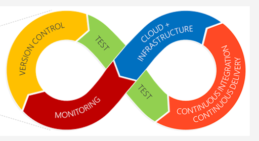

# devopsy


Graphic by W.P. Schuab

My cubby for devops stuff I craft that others may like too.

# [Contents](#contents)

- [getopt](#getopt)
- [mkpy](#mkpy)

-----

## [getopt](#contents)

Are you throwing together a bash script and would like some fu for parsing your command line arguments into variables?

Take a look at this [skeleton shell script](getopt/test_getopt.sh) which leverages ```getopt```, a shell builtin command for doing just that.

## [mkpy](#contents)

Part of the devops world includes build automation.  

If you ever find yourself down a dark alley and need to throw down with some makefile fu, here's a non-trivial example that builds python from a downloaded
source bundle:

It demonstrates:

* Use of target / dependencies to make your builds idempotent and efficient.
* Downloading the source bundle from an upstream website with optional md5 bundle check.
* Verbosity control (so build warnings & errors don't go unnoticed amidst the chatter).
* Component-based autologging of build output (see python.log).
* Manifest-based installs for surgical uninstalls if your dev work flow requires that.
* Post-build checking of shared library dependencies and runtime search paths (i.e., rpath audit) so you understands the runtime behavior of your build targets for added insight and security.

<pre>
DevOpsy python makefile

Usage: 

       make             # for help verbiage
       make target
       make target V=1  # for verbose output

where target is one or more of the following:
-----------------------------------------------------------------------------
all			   configure		      python
build			   export		      settings
check			   help
checkenv		   manifests
-----------------------------------------------------------------------------
install			   uninstall
installhere		   uninstallhere
-----------------------------------------------------------------------------
clean			   distclean		      mrclean
-----------------------------------------------------------------------------
</pre>

TODO: This was most recently dev'd on macOS.  Linux should work too, but needs testing.
